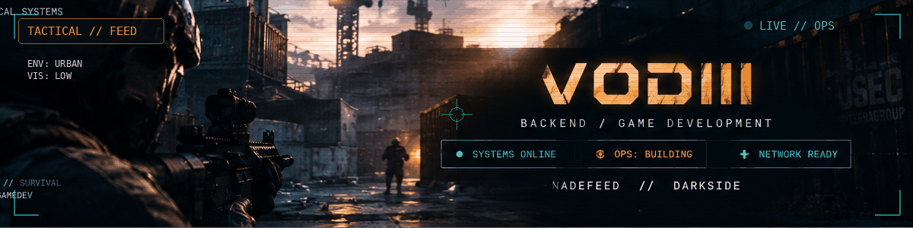

<div align="center">


<br/>


</div>

<br/>

---

## `// CURRENT OPERATIONS`

<table>
<tr>

<td width="50%" valign="top">

<h3>

</h3>

<p><b>CS2 Tactical Platform</b></p>

<p>
A tactical knowledge base for Counter-Strike 2.
Grenades, maps, lineups, search and authentication.
</p>


<br/><br/>


</td>

<td width="50%" valign="top">

<h3>

</h3>

<p><b>Networked Tactical FPS Prototype</b></p>

<p>
A multiplayer tactical FPS prototype focused on
movement, weapons, ballistics, stamina and replication.
</p>


<br/><br/>


</td>

</tr>
</table>

---

## `// TACTICAL FEED`

<div align="center">



<br/><br/>


<br/>

<sub>
Visual direction inspired by tactical FPS interfaces, urban combat environments and in-game HUD systems.
</sub>

</div>

<br/>

---

## `// LOADOUT`

<table>
<tr>

<td width="50%" valign="top">

<h3 align="center">BACKEND</h3>

<p align="center">


</p>

</td>

<td width="50%" valign="top">

<h3 align="center">GAMEDEV</h3>

<p align="center">


</p>

</td>

</tr>
</table>

---

## `// SPECIALIZATION`

<table>
<tr>

<td width="50%" valign="top">

<div align="center">


<br/><br/>


<br/><br/>

<b>REST APIs</b><br/>
<b>Authentication</b><br/>
<b>Authorization</b><br/>
<b>Security</b><br/>
<b>PostgreSQL</b><br/>
<b>EF Core</b><br/>
<b>Docker</b><br/>
<b>OpenAPI</b>

</div>

</td>

<td width="50%" valign="top">

<div align="center">


<br/><br/>


<br/><br/>

<b>Unreal Engine 5</b><br/>
<b>C++20</b><br/>
<b>Multiplayer</b><br/>
<b>Networking</b><br/>
<b>Replication</b><br/>
<b>Ballistics</b><br/>
<b>Weapon Systems</b><br/>
<b>Gameplay Systems</b>

</div>

</td>

</tr>
</table>

<br/>

<div align="center">


</div>

---

## `// DARKSIDE // COMBAT SYSTEMS`

<table>
<tr>

<td width="50%" valign="top">

**MOVEMENT**

```text
✓ Sprint
✓ Walk / Slow Walk
✓ Crouch
✓ Lean
✓ Stamina
✓ Breath Holding
